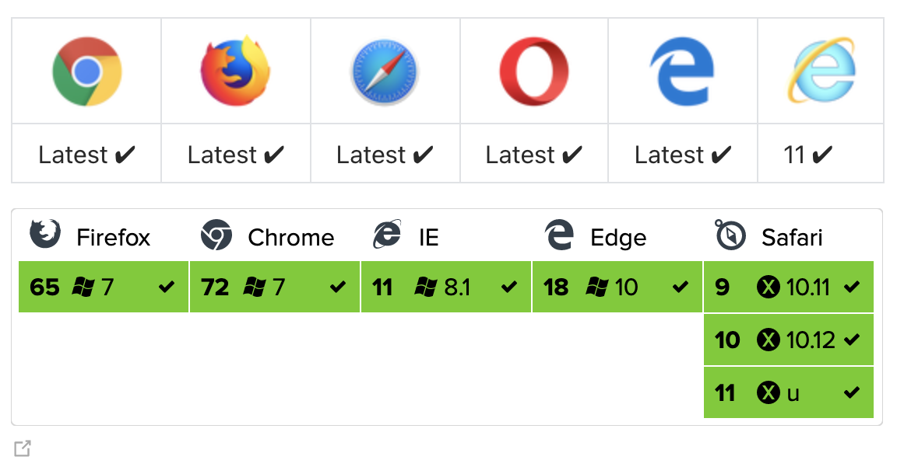

# Axios

Axios는 Promise API를 활용하는 HTTP 비동기 통신 라이브러리입니다. 

> Promise란?
>
> Promise는 ES6에서 비동기 처리를 다루기위해 사용되는 객체입니다.
>
> 참고 : [Promise](https://github.com/jewdri-kim/javascriptStudy/tree/master/async/promise)

### Axios 특징

- 운영 환경에 따라 브라우저의 [XMLHttpRequest](https://developer.mozilla.org/ko/docs/Web/API/XMLHttpRequest) 객체 또는 Node.js의 [http](https://nodejs.org/api/http.html) api 사용
- [Promise](https://developer.mozilla.org/ko/docs/Web/JavaScript/Reference/Global_Objects/Promise)(ES6) API 사용
- 요청과 응답 데이터의 변형
- HTTP 요청 취소
- HTTP 요청과 응답을 JSON 형태로 자동 변경

### 브라우저 호환성



### Vue 프로젝트에 axios 설치하기

1. npm으로 설치

   `npm install --save axios`

2. yarn을 설치

   `yarn add axios`

3. 직접 웹페이지에 입력

   `<script src="https://unpkg.com/axios/dist/axios.min.js"></script>`

### Axios 사용하기

axios는 Promise 기반의 자바스크립트 비동기 처리방식을 사용합니다. 그래서 요청후 .then()으로 결과값을 받아서 처리하는 형식으로 구성되어 있습니다.

```javascript
axios.get('/api/data')
  .then(res => { 
  console.log(res.data) 
})
```

`/api/data`에서 데이터를 불러옵니다. 불러온 데이터는 `.then()`의 `res`(response)에 담아서 처리하는 식입니다.

#### GET

GET은 서버로부터 데이터를 가져오는데 사용합니다.

형태  `axios.get(url[, config])`

axios 요청 시 파라메터 정보(`/api/data/1`)를 같이 입력하여 정보를 얻어 올 수 있습니다. 아래의 요청은 하나의 상세정보를 불러오는것입니다.

```javascript
axios.get('/api/data/1')
  .then(res => { 
  console.log(`status code: ${res.status}`)
  console.log(`headers: ${res.headers}`) 
  console.log(`data: ${res.data}`) 
})
```

> 템플릿 리터럴의 ${} 문법을 활용하여 문자열을 쪼개지 않고 동적으로 표현

axios 요청 시 파라메터 정보가 아니라 메소드의 두번째 인자인 config 객체로 요청값을 넘길 수 있습니다.

```javascript
axios.get('/api/data', { 
  params: { title: 'vue.js는 조으다.' }, 
  headers: { 'X-Api-Key': 'my-api-key' }, 
  timeout: 1000 // 1초 이내에 응답이 없으면 에러 처리 
}).then(res => { 
  console.log(res.data) 
})
```

#### POST

값 입력하기

형태 `axios.post(url[, data[, config]])`

`/api/data`에 값을 입력 할 때 사용합니다. 서버의 데이터 리스트의 마지막에 지금 넘기는 정보를 추가 합니다.

```javascript
axios.post('/api/data', {title: "vue.js는 조으다."}) 
  .then(res => { 
  console.log(res.data) 
})
```

#### PATCH

특정 값 수정하기

형태 `axios.patch(url[, data[, config]])`

`/api/data/3`에 값을 입력 할 때 사용합니다. 서버의 데이터 리스트 중 `3`에 해당 하는 값의 `title`를 수정합니다.

```javascript
axios.patch('/api/data/3', {title: "vue.js는 조으다."}) 
  .then(res => { 
  console.log(res.data) 
})
```

#### DELETE

특정 값 삭제하기

형태 `axios.delete(url[, config])`

`/api/data/3`에 값을 삭제 할 때 사용합니다.
서버의 데이터 리스트 중 `3`에 해당 하는 값을 삭제 합니다.

```javascript
axios.delete('/api/data/3')
  .then(res => {
    console.log(res.data)
  })
```

### Axios 서버 통신 해보기

실제 API를 가지고 서버 통신을 해보고 싶으면 [FakeServer](https://reqres.in/)로 통신 테스트해보기


참고

https://xn--xy1bk56a.run/axios/guide/

https://uxgjs.tistory.com/138

https://velog.io/@zofqofhtltm8015/Axios-%EC%82%AC%EC%9A%A9%EB%B2%95-%EC%84%9C%EB%B2%84-%ED%86%B5%EC%8B%A0-%ED%95%B4%EB%B3%B4%EA%B8%B0

https://hjcode.tistory.com/63
